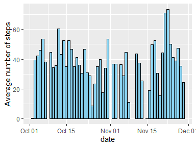
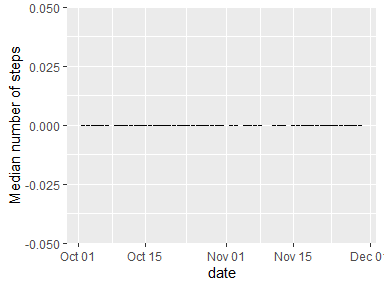
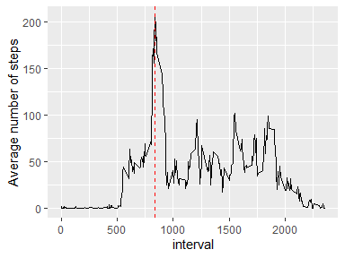
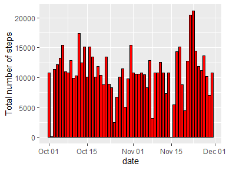
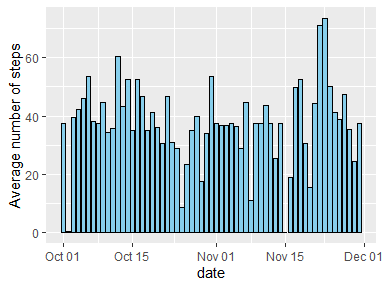
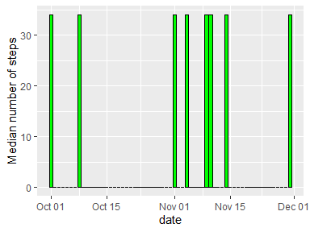
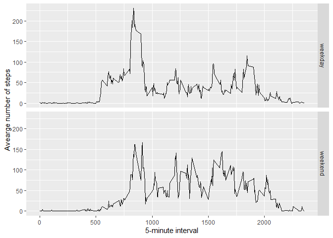

## Loading and preprocessing the data
The data from csv file was saved in variable "data" without unzipping the archive containing file "activity.csv". The class of variable "date" in the second column of "data" was transformed from "character" into "date" with removing of quotes symbols. The name of each column in resulted "data" was remained as in the initial file.

```r
library(ggplot2)
library(dplyr)
```

```
## 
## Attaching package: 'dplyr'
```

```
## The following objects are masked from 'package:stats':
## 
##     filter, lag
```

```
## The following objects are masked from 'package:base':
## 
##     intersect, setdiff, setequal, union
```

```r
library(lattice)
data <- read.csv(unz("repdata_data_activity.zip", "activity.csv"), sep = ",", skip=1, header=FALSE)
data$V2 <- as.Date(gsub('"', '',  data$V2), format="%Y-%m-%d")
colnames<-as.character(read.csv(unz("repdata_data_activity.zip", "activity.csv"), sep = ",", nrow=1, header=FALSE))
colnames(data)<-colnames
```

## What is mean total number of steps taken per day?
The mean value of overall number of total steps made at each day was calculated, and then it was plotted by using ggplot2 library.  

```r
mean_day <- aggregate(steps ~ date, data, mean, na.rm = TRUE)
ggplot(mean_day, aes(x=date, y=steps))+geom_bar(stat = "identity", fill = "skyblue", color = "black")+ylab("Average number of steps")
```

<!-- -->

The median value of overall number of total steps made at each day was calculated, and then it was plotted by using ggplot2 library.  

```r
median_day <- aggregate(steps ~ date, data, median, na.rm = TRUE)
ggplot(median_day, aes(x=date, y=steps))+geom_bar(stat = "identity", fill = "skyblue", color = "black")+ylab("Median number of steps")
```

<!-- -->

```r
zero_sum <- sum(data$steps == 0, na.rm = TRUE)
na_sum <- sum(is.na(data$steps))
steps_sum <-nrow(data)
value_sum <- round((steps_sum - na_sum - zero_sum)*100/steps_sum,1)
```

As can be seen, the median value for each day is equal 0. It can be explained by the fact that among 17568 "step" values, 11014 values equals zero, and  2304 values are missed (NA). So, only 24.2% of records has "steps" values greater than zero.


## What is the average daily activity pattern?
We calculate the average number of total steps taken in each 5-minute interval, averaged across all days. The calculated average values were plotted against their 5-minute interval.


```r
mean_interval <- aggregate(steps ~ interval, data, mean, na.rm = TRUE)
max_st <- which.max(mean_interval$steps)
int_at_max_st <- mean_interval$interval[max_st]
ggplot(mean_interval, aes(x=interval, y=steps))+geom_line()+ylab("Average number of steps")+geom_vline(xintercept = int_at_max_st, linetype = "dashed", color = "red")
```

<!-- -->

**As can be seen, the maximum steps in average for all days was made for 5 minute interval of 835.**

## Imputing missing values
First of all, we calculate number of rows that contain at least one NA value for any variable.

```r
any_na_sum <- sum(rowSums(is.na(data)) > 0)
```
As can be seen, 2304 rows have missed values (NA).

We create new dataset "data1" in which we fill in all of the missing values by the mean for that 5-minute interval.

```r
data1 <- data %>%
  group_by(interval) %>%
  mutate(steps = ifelse(is.na(steps), mean(steps, na.rm = TRUE), steps)) %>%
  ungroup()
na_sum1 <- sum(is.na(data1$steps))
na_in_data1 <- sum(rowSums(is.na(data1)) > 0)
nr_data <-nrow(data)
nr_data1 <-nrow(data1)
```
We created new dataset "data1" that contains 17568 rows, which is the same number of rows of 17568 as the initial dataset "data". New dataset "data1" contains 0 rows with missing values (NA).  

We calculate the total number of total steps taken each day for corrected dataset "data1", in which the missed values were replaced by the average value for the corresponded 5-minutes interval. The total number of steps were plotted against the corresponding day by using ggplot2 library.  

```r
sum_day_1 <- aggregate(steps ~ date, data1, sum, na.rm = TRUE)
ggplot(sum_day_1, aes(x=date, y=steps))+geom_bar(stat = "identity", fill = "red", color = "black")+ylab("Total number of steps")
```

<!-- -->

The mean value of overall number of total steps made at each day was calculated, and then it was plotted by using ggplot2 library.  

```r
mean_day1 <- aggregate(steps ~ date, data1, mean, na.rm = TRUE)
ggplot(mean_day1, aes(x=date, y=steps))+geom_bar(stat = "identity", fill = "skyblue", color = "black")+ylab("Average number of steps")
```

<!-- -->

We also calculate the median of total number of steps taken each day for corrected dataset "data1", and plotted against the corresponding day by using ggplot2 library.  

```r
median_day_1 <- aggregate(steps ~ date, data1, median, na.rm = TRUE)
ggplot(median_day_1, aes(x=date, y=steps))+geom_bar(stat = "identity", fill = "green", color = "black")+ylab("Median number of steps")
```

<!-- -->


```r
nr_median<-nrow(median_day)
nr_median_1<-nrow(median_day_1)
nr_difference<-nr_median_1-nr_median
sum_1<-sum(data$steps, na.rm=TRUE)
sum_2<-sum(data1$steps, na.rm=TRUE)
sum_2<-format(sum_2, scientific = FALSE)
```

As we can see, imputing missing values revealed that **8 days had no single record**. Therefore, imputing missing values by the values calculated based on the average values for the same 5-minutes interval **increased number of records (days) from 53 up to 61**. The graph of "Avearge number of steps" for new dataset "data1" does not have the gaps, and more notiecable indication can be seen for "Median number of steps" - there are eight columns greater than zero since all missed values were replaced by the values greater than zero.

**Imputing missing data resulted in the increase of the total daily number of steps from 570608 up to 656737.5.**


## Are there differences in activity patterns between weekdays and weekends?

We create third version of dataset "data3" by addition of weekdays and category of weekdays in the corrected dataset "data1" (after imputing missing data)  

```r
data2 <- mutate(data1, day = weekdays(data$date)) %>%
  mutate(category = ifelse(day %in% c("Monday", "Tuesday", "Wednesday", "Thursday", "Friday"), "weekday", "weekend"))
data3 <- aggregate(steps ~ interval + category, data=data2, mean)
ggplot(data3, aes(interval, steps)) + geom_line() + facet_grid(category ~ .) +
    xlab("5-minute interval") + ylab("Avearge number of steps")
```

<!-- -->


